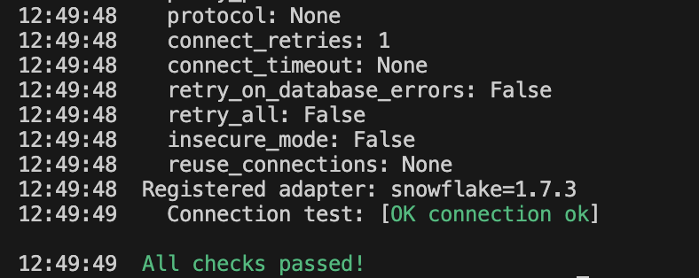
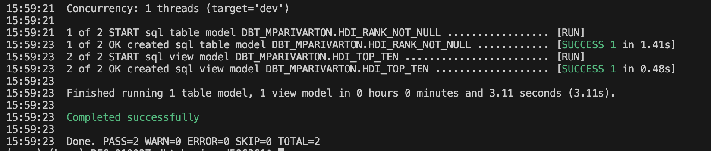

#########################
This repo is about how to setup dbt; create incremental models and use basic dbt commands to load data into snowflake

Steps:
1) Create a python virtual environment
python -m venv venv
2) Activate python virtual environment
source venv/bin/activate
3) Install all requirements (check the requirements.txt file to understand what all packages are needed)
pip install -r ./app/requirements.txt
4) Run dbt init command
dbt init
This would initialize your dbt project. Before project creation, it would prompt you for few inputs like shown below:
Which database would you like to use?
[1] snowflake

(Don't see the one you want? https://docs.getdbt.com/docs/available-adapters)

Enter a number: <Enter 1 as we need to use snowflake>
account (https://<this_value>.snowflakecomputing.com):<Provide your snowflake account>
user (dev username): <Provide snowflake username>
[1] password
[2] keypair
[3] sso
Desired authentication type option (enter a number):<I am chosing 1 as I will use password for authentication>
password (dev password): <Enter your password>
role (dev role): <Enter role which would be used to run dbt models>
warehouse (warehouse name): <Enter warehouse name which would be used to run dbt models>
database (default database that dbt will build objects in): <Enter database name where dbt will create objects or append data>
schema (default schema that dbt will build objects in): <Enter default schema in the database to be used by dbt>
threads (1 or more) [1]: <Enter number of threads to be used>
After all the above steps, a dbt profile(in my case profile name is dbt_basics) will be created with different set of folders like analyses, macros, models, seeds etc.
You can run the command "dbt debug" to check if the connection is valid or not
Before running the dbt debug command, make sure the connection variables are properly set in your profiles.yml file. Try using env_var (environment variables) for username and password and export them as shown below 
export SNOWFLAKE_PASSWORD=<yourpassword>
export SNOWFLAKE_USER=<yourusername>
The dbt debug command should be successful otherwise there is an issue with your connection. Check your credentials in the profiles.yml file. Make sure indentation in yaml file is correct and the env_var are within double quotes

You can also see that a log file would be generated which will contain all the steps showing how the connection was made etc. This log file could be used for debugging purposes

######################################Running your dbt models###############################
You can run your dbt model by using the command "dbt run --select <modelname>" or just "dbt run" to run all the models

In here, I have taken sample data from https://mavenanalytics.io/data-playground and loaded this data into snowflake table which is defined in the source.yml file
There are 2 models here. 
The first model "HDI_RANK_NOT_NULL" is filtering the source table for all countries which have non-null HDI rank. The materialization is defined as table in the model file itself. So, this would recreate the table every time you run the model
The second model is referring to the first model and picking up all countries with HDI rank less than equal to 10. Since, the materialization is not defined here, it is taking the materialization as view from the dbt_project.yml file.
On doing a dbt run, you can see the ouput that it ran 1 table model and 1 view model

